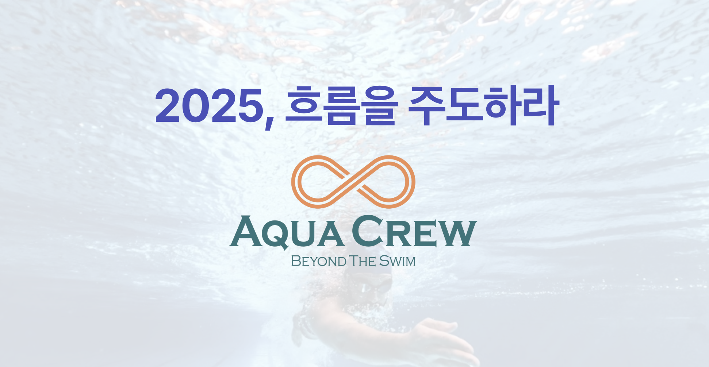

2025 아쿠아크루 슬로건 공모전은 우리 팀의 미래 비전을 담아내는 뜻깊은 행사였습니다. 크루원들의 열정과 창의성이 돋보인 이번 공모전에서, "2025, 흐름을 주도하라!"라는 슬로건이 1등으로 선정되었습니다. 

이 슬로건은 아쿠아크루의 도전 정신을 담아내면서도, 수영의 본질인 물살을 가르는 역동성을 연상시킵니다. 단순한 기록 경신을 넘어 수영계의 새로운 방향을 제시하고, 변화를 주도하겠다는 우리의 강한 의지가 담겨 있습니다. 심플하면서도 강렬한 이 표현은 아쿠아크루가 선구적인 팀으로 나아가는 모습을 잘 보여주고 있습니다.

## 공모전 개요

- 주제: 2025년 아쿠아크루의 비전을 담은 슬로건
- 기간: 2025년 1월 7일 ~ 2025년 1월 12일
- 참가자격: 아쿠아크루 전 회원

## 수상작

1. 🥇 **1등**: "2025, 흐름을 주도하라!" - 심OO 님
2. 🥈 **2등**: "Take your marks" - 신OO 님
3. 🥉 **3등**: "1 1 1 1" (1인 1대회 1종목 1메달) - 조OO 님

## 전체 출품작

1. "1 1 1 1" (1인 1대회 1종목 1메달) - 조OO
2. "수영복은 작아지고, 기록은 단축되고, 우승을 향해!" - 장OO
3. "수생수사, All for Swim, Swim for All, 2025! 우리는 아쿠아크루" - 박OO
4. "2(이제는)0(영하게)2(20초대를 향해)5(오마이갓)" - 최OO
5. "2025, 흐름을 주도하라!" - 심OO
6. "근성을 깨우자. "just keep going"" - 인OO
7. "그저 물이 되어라" - 김OO
8. "Do the Swim" - 손OO
9. "Dive Deep, Rise Higher: AquaCrew 2025" - 장OO
10. "Take your marks" - 신OO
11. "2025는 PB의 해. 빽초 금지!" - 김OO

## 심사 방법
- 전체 크루원 투표

## 슬로건 활용 계획

1. 아쿠아크루 웹사이트 및 공식 문서에 반영
2. SNS 프로필 및 게시물에 활용
3. 이벤트 및 대회의 주제로 사용

우리 모두 이 슬로건처럼 2025년에는 수영계의 흐름을 주도하는 아쿠아크루가 되기를 기대합니다!

창의적이고 의미 있는 슬로건들을 제안해 주신 모든 크루원 분들께 감사드립니다. 

아쿠아크루 화이팅! 🏊‍♂️💪