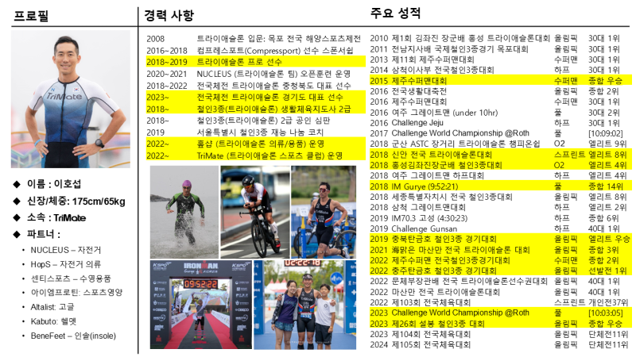

- 앨범: [BAND LINK](https://band.us/band/93484357/album/85314858)

## 이호섭 프로

## 훈련 프로그램 

### **06:30 ~ 06:50: 준비 운동 및 워밍업**

| **구분**              | **내용**                                                                                   | **설명**                                                                                     |
|-----------------------|-------------------------------------------------------------------------------------------|---------------------------------------------------------------------------------------------|
| **사전 스트레칭**      | 동적 스트레칭 (Dynamic Stretching)                                                        | 주요 근육군(둔근, 햄스트링, 대퇴사두근, 종아리)을 중심으로 동적 스트레칭.  |
| **심박수 올리기**      | 팔벌려뛰기 (Jumping Jacks)                                                                | 20회 반복하여 심박수를 서서히 올림.                                                         |
| **워밍업 러닝**        | 400m 트랙 조깅                                                                           | 느린 페이스로 몸을 풀고 마지막 2바퀴는 본인 페이스로 달리기.                                 |

### **06:50 ~ 07:30: 드릴 연습**

| **구분**              | **내용**                                                                                   | **설명**                                                                                     |
|-----------------------|-------------------------------------------------------------------------------------------|---------------------------------------------------------------------------------------------|
| **팔 동작 연습**       | 팔치기 (Arm Swing Drill)                                                                  | 팔꿈치를 90도로 유지하며 앞뒤로 흔들기. 어깨에 힘을 빼고 중심선에서 벗어나지 않도록 주의.     |
|                       | 팔치기 + 제자리뛰기 (Arm Swing with Stationary Running)                                   | 팔 동작과 함께 제자리 뛰기를 병행하며 리듬감을 익힘.                                         |
| **다리 동작 연습**     | 숏피치 제자리뛰기 (Short Stride Stationary Running)                                       | 짧고 빠른 발 움직임으로 케이던스(발걸음 수)를 높이는 연습.                                   |
|                       | 하이 피치 (High Stride Running)                                                          | 무릎을 조금 더 높게 들어올리며 피치를 유지.                                                  |
|                       | A 스킵 (A-Skip Drill)                                                                     | 무릎을 높게 들어올리고 발을 아래로 내리며 추진력을 강화하는 드릴.                            |
|                       | High Knee Bounce                                                                         | 무릎을 높게 들어올리며 발끝으로 튀어오르는 동작 반복. 리듬감과 반응성을 키움.                |
|                       | 2-Step Bound                                                                             | 두 걸음씩 점프하며 뒤꿈치를 허벅지 뒤쪽으로 붙이는 동작 연습. 고관절과 햄스트링 활용 극대화.  |
| **리듬 및 속도 연습**  | 180 BPM에 맞춘 케이던스 연습                                                              | 메트로놈이나 음악을 활용하여 180bpm에 맞춰 발걸음 리듬 유지.                                |
|                       | Pitch와 Bound 동작 짧은 거리 반복                                                        | 각각 2세트씩 수행하여 기술 숙련도를 높임.                                                   |

### **07:30 ~ 07:40: 스트레칭 및 근력 강화 운동**

| **구분**              | **내용**                                                                                   | **설명**                                                                                     |
|-----------------------|-------------------------------------------------------------------------------------------|---------------------------------------------------------------------------------------------|
| **스트레칭**           | 고관절 스트레칭 (Hip Mobility Stretching)                                                 | 예: 고관절 회전 운동(Hip Circles).                          |
| **근력 강화 운동**     | 와이드 스쿼트 (Wide Stance Squat)                                                        | 다리를 넓게 벌리고 스쿼트를 실시하여 고관절과 둔근 강화.                                     |

### **07:40 ~ 08:00: 메인 러닝**

| **구분**              | **내용**                                                                                   | **설명**                                                                                     |
|-----------------------|-------------------------------------------------------------------------------------------|---------------------------------------------------------------------------------------------|
| **전력질주 연습**      | 전력질주 트랙 한 바퀴 (400m Sprint)                                                       | 최대 속도로 트랙 한 바퀴를 달려 근력과 심폐 지구력을 테스트.                                  |

### **08:00 ~ 08:20: 자율 러닝**

| **구분**              | **내용**                                                                                   | **설명**                                                                                     |
|-----------------------|-------------------------------------------------------------------------------------------|---------------------------------------------------------------------------------------------|
| **자율 러닝**          | 20분 자율 러닝 (Self-Paced Running)                                                      | 본인의 페이스로 지속적인 러닝 실시하여 체력과 페이스 조절 능력 향상.                         |

### **08:20 ~ 08:30: 정리운동 및 스트레칭**

| **구분**              | **내용**                                                                                   | **설명**                                                                                     |
|-----------------------|-------------------------------------------------------------------------------------------|---------------------------------------------------------------------------------------------|
| **정적 스트레칭**      | 주요 근육군 스트레칭                                                                      | 둔근, 대퇴사두근, 햄스트링, 종아리를 중심으로 심박수를 낮추고 근육 긴장을 풀어줌.             |

