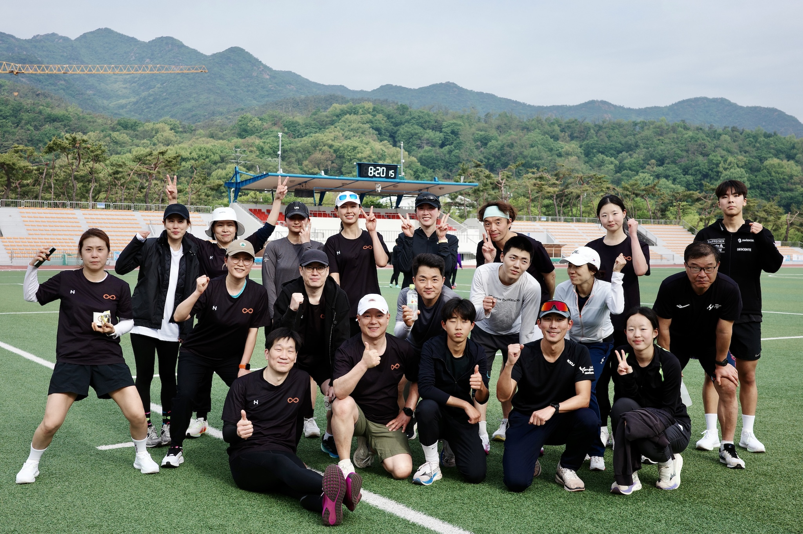

- 앨범: [BAND LINK](https://band.us/band/93484357/album/86392322)

---

* 일시: 2025년 5월 5일(월) 06:30~08:00
* 장소: 관문체육공원

---

## 1. 전체 일정

| 구분             | 내용                                               | 비고          |
|------------------|----------------------------------------------------|---------------|
| 동적 스트레칭    | 전신 준비 운동, 부상 예방 및 가동성 향상           | 약 10분       |
| 메인 러닝        | 관문체육공원 출발 → 과천대공원 한 바퀴 → 복귀      | 약 5.5km      |
| 러닝 드릴        | 자세 교정과 효율적 러닝을 위한 동작 반복           | 자세히 아래 참조 |
| 트랙 러닝        | 400m 트랙 5바퀴 (2km)                              | 페이스 조절 훈련 |
| 스프린트         | 축구장 대각선(100m) 전력질주 × 2회                 | 스피드 향상   |

---

## 2. 러닝 드릴 소개

| 드릴명      | 목적설명                                                                |
|-------------|--------------------------------------------------------------------------|
| 팔치기      | 상체 리듬과 팔 동작 교정, 러닝 밸런스 잡기                              |
| A스킵       | 무릎을 높이 들며 리듬감 있게 스텝, 하체 근력과 스텝 반응 향상            |
| C스킵       | 무릎을 앞, 옆, 뒤로 다양하게 움직이며 고관절 가동성 및 균형 강화         |
| 하이니 바운스| 무릎을 빠르고 높게 들어 올리며 반발력과 스피드, 러닝 자세 개선           |
| 숏피치      | 짧고 빠른 스텝, 발 착지 빈도 증가로 스피드와 민첩성 훈련                 |
| 미드피치    | 숏피치보다 여유 있는 중간 템포, 효율적 주법과 페이스 감각 익히기         |

---

## 3. 프로그램 목적

- 러닝 기본기와 효율적인 자세 습득
- 페이스 조절, 지구력, 스피드, 민첩성 및 부상 예방
- 다양한 드릴과 트랙, 스프린트로 실전 감각 향상

---

