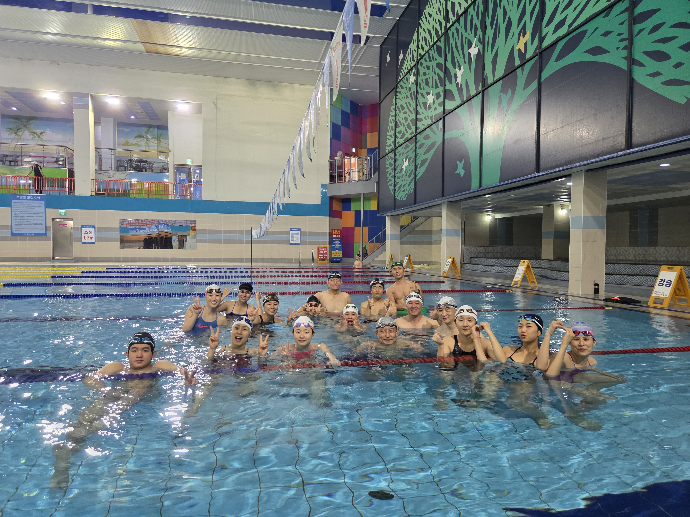

- 참가신청: [BAND LINK](https://band.us/band/93484357/schedule/4%2F93484357%2F769237334%2F19700101)
- 앨범: [BAND LINK](https://band.us/band/93484357/album/87443787)

## 스타트 강화! 지상 훈련 프로그램

| 훈련 명칭 | 훈련 방법 | 목적 및 효과 |
| :--- | :--- | :--- |
| **밴드 스타트 풀** | 1. 발볼에 밴드를 걸고 엎드립니다. 2. 밴드를 등 뒤로 짧게 잡고, 등과 엉덩이 힘으로 당깁니다. 3. 이때 고개는 들지 않고 바닥을 향해 중립을 유지합니다. | **[폭발력 강화]** 스타팅 블록을 박차고 나가는 순간의 폭발적인 힘과 유사한 근육(등, 엉덩이, 허벅지 뒤)을 단련합니다. |
| **벽 카프레이즈 & 턱 당기기** | 1. 벽에 등을 편안하게 기대고 섭니다. 2. 까치발을 들며 종아리에 힘을 주고, 동시에 턱을 당겨 뒤통수를 벽에 붙입니다. | **[자세 교정 & 발목 강화]** 블록을 끝까지 밀어주는 발목의 힘과 안정성을 기르고, 입수 자세를 위한 중립 척추를 연습합니다. |
| **스트림라인 점프 스쿼트** | 1. 스쿼트 자세에서 있는 힘껏 위로 점프합니다. 2. 최고 지점에서 팔을 위로 쭉 뻗어 유선형 자세(Streamline)를 만들고, 턱을 당깁니다. | **[순발력 향상]** 스타트의 핵심인 하체 폭발력을 기릅니다. 공중에서 유선형 자세를 잡는 연습을 동시에 합니다. |
| **월 워크 (Wall Walk)** | 1. 하이 플랭크 자세에서 벽에 발을 댑니다. 2. 한 발씩 벽을 타고 올라갔다가, 천천히 한 발씩 다시 내려옵니다. | **[코어 & 어깨 안정성]** 강력한 어깨와 코어 근력을 만들어, 입수 시 충격을 흡수하고 단단한 몸을 유지하게 합니다. |
| **플랭크 투 파이크** | 1. 하이 플랭크 자세에서 시작합니다. 2. 엉덩이를 높이 들어 올리며 머리는 팔 사이로 넣어 발끝을 바라봅니다. (다운독 자세) | **[코어 강화 & 유연성]** 코어 근력과 함께 어깨 유연성을 향상시키며, 입수 시 몸을 접었다 펴는 동작에 도움을 줍니다. |
| **슈퍼맨 플러터킥** | 1. 바닥에 배를 대고 엎드려 팔다리를 듭니다. 2. 그 상태에서 팔과 다리를 위아래로 교차하며 빠르게 흔들어줍니다. | **[수중 돌핀킥 강화]** 강력한 수중 돌핀킥과 자세 유지를 위한 등, 엉덩이, 허리 근육(후면 사슬)을 단련합니다. |
| **스트림라인 프레스** | 1. 엎드려 누워 팔다리를 든 상태를 유지합니다. 2. 뒤통수 쪽으로 팔을 당겼다가 앞으로 쭉 뻗어줍니다. 3. 뻗을 때 턱을 당기며 완벽한 유선형 자세를 만듭니다. | **[유선형 자세 강화]** 견갑골 주변 근육을 강화하여, 물속에서 흔들림 없는 단단한 유선형 자세를 만드는 데 필수적입니다. |

<!--  -->