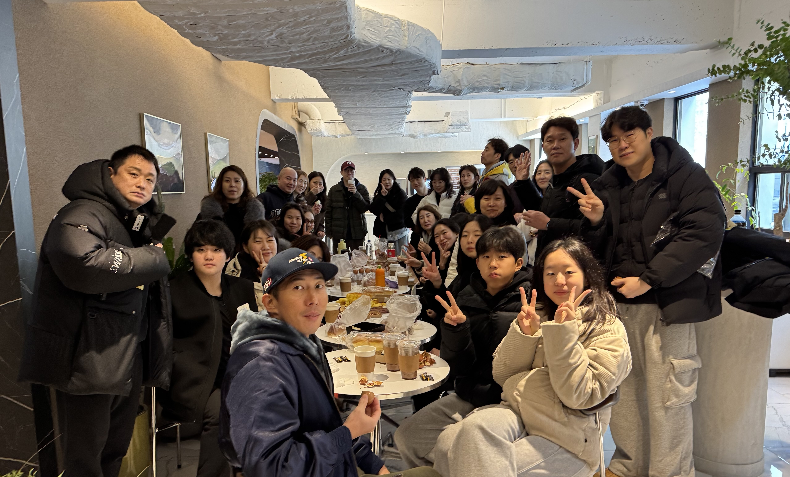

**서른번째 정모**

- 참가신청: [BAND LINK](https://band.us/band/93484357/schedule/4%2F93484357%2F597447872%2F19700101)
- 앨범: [BAND LINK](https://band.us/band/93484357/album/85028302)

**시간**: 09:00~11:00  

---

## 1. Warm-up (웜업, 5분)  
| 운동 | 거리 (m) | 세부 사항 |
|------|----------|-----------|
| 자유형 | 200 | 자율 웜업 (Choice) |

---

## 2. Pre Set (20분, 세트 간 휴식 2분)  
**W.B (킥판 사용)**  

| 운동 | 거리 (m) | 반복 | 사이클 시간 | 총 거리 (m) |
|------|----------|------|-------------|-------------|
| 자유형 킥 | 50 | 4회 | 1분 10초 / 1분 20초 | 200 |
| 자유형 킥 | 35 | 4회 | 50초 / 1분 | 140 |
| 배영 킥 | 50 | 4회 | - | 200 |
| 돌핀 킥 | 35 | 4회 | - | 140 |
| 수직 킥 (Vertical Kick) | - | 30초 x 4회 | - |

---

## 3. 자유형 드릴 (20분)  
### **1그룹**  
| 운동 | 거리 (m) | 반복 |
|------|----------|------|
| 자유형 드릴 (Free Drill) | 100 | 6회 |
| 자유형 (Free Swim) | 100 | 3회 |

### **2그룹**  
- 자유형 킥 드릴

---

## 4. Main Set (35분, 세트 간 휴식 2분)  
**W.F (핀 착용)**  

### **1그룹**  
총 거리: **1,600m**  

| 운동 | 거리 (m) | 시간/Cycle |
|------|----------|------------|
| 자유형 (Free) | 100 | In time: 1’20 / Cycle: 1.20cy |
| 자유형 (Free) | 200 | In time: 2’40 / Cycle: 1.20cy |
| 자유형 (Free) | 300 | In time: 4’30 / Cycle: 1.30cy |
| 자유형 (Free) | 400 | In time: 6’00 / Cycle: 1.30cy |
| 자유형 (Free) | 300 | In time: 4’30 / Cycle: 1.30cy |
| 자유형 (Free) | 200 | In time: 2’40 / Cycle: 1.20cy |
| 자유형 (Free) | 100 | In time: 1’20 / Cycle: 1.20cy |

---

### **2그룹**  
총 거리: **1,700m**  

- 인터벌 훈련  
- **자유형**: **100m x17회**  
- 사이클 시간: **In time: 1’40 / Cycle: 1.40cy**

---

## 5. 스타트 연습 (35분)

### 스타트 다이브 훈련
| 운동                  | 거리 (m)   | 반복        |
|-----------------------|------------|-------------|
| 스타트 다이브         | **15m**    x **6회**     홀수(스트림라인), 짝수(브레이크 아웃) |
| 스타트 다이브         | **25m**    x **4회**     무호흡/스트로크 체크 |
| 이벤트 스타트         | **25m**    x **4회**     이벤트별 스타트 연습 |
| 전력 질주(All Out)    | **50m**    x **2회**     최대 속도로 수행 |

---

## Cool-down
- 자유 선택 운동, 총 거리 **50m**

---

## 총 훈련 거리
- **1그룹**: 약 **3,690m**
- **2그룹**: 약 **3,790m**

---

## 초보자를 위한 추가 설명:
1. **사이클(Cycle)이란?**
   - 주어진 시간 내에 수영을 완료하고 남은 시간을 쉬는 방식.
   - 예를 들어, "In time: 1'20"은 해당 거리를 최대한 효율적으로 수영한 뒤 남은 시간 동안 휴식을 취함.

2. **스트림라인(Streamline)이란?**
   - 물속에서 몸을 유선형으로 만들어 저항을 최소화하는 자세.
   - 머리부터 발끝까지 일직선을 유지하며 추진력을 극대화.

3. **브레이크 아웃(Break Out)이란?**
   - 돌핀킥 후 물 밖으로 나오는 동작.
   - 물속에서의 추진력을 유지하며 자연스럽게 스트로크로 연결.

4. 무리하지 말고 자신의 페이스에 맞춰 진행하세요!
