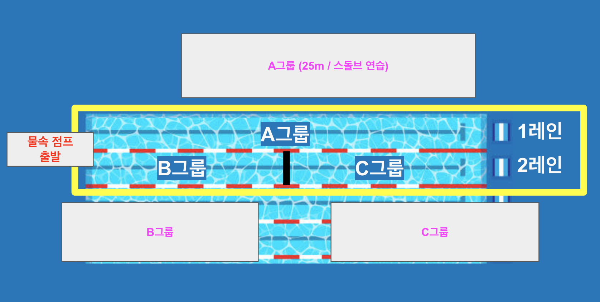

- 참가신청: [BAND LINK](https://band.us/band/93484357/schedule/4%2F93484357%2F649935300%2F19700101)
- 앨범: [BAND LINK](https://band.us/band/93484357/album/86076235)

---

**2025-04-19 (토) 09:00~10:00**  
**장소:** KBS 스포츠월드 (1,2레인/턴보드 설치)

---

### 1. Warm up (09:00~09:10, 10분)

| 구분        | 내용                  | 반복  | 시간 (분) |
|-------------|-----------------------|-------|-----------|
| KICK        | 100m                  | 2회   | 4         |
| Freestyle   | 100m                  | 3회   | 6         |

---

### 2. Main Set (09:10~09:50, 40분)

#### 1레인 (A그룹)

| 구분                   | 내용                        | 반복       | 시간 (분)  |
|------------------------|-----------------------------|------------|------------|
| NB freestyle kick      | 킥판 없이 자유형 킥 25m     | 4회        | 약 4        |
| NB 본인 종목 kick      | 킥판 없이 본인 종목 킥 25m  | 4회        | 약 4        |
| 스타트&돌핀킥&브레이크아웃 | 25m                      | 무한 반복  | 잔여 시간   |

#### 2레인 (B그룹 & C그룹)

| 구분         | 내용                          | 반복                        | 사이클    | 시간 (분)    |
|--------------|-------------------------------|-----------------------------|-----------|--------------|
| Freestyle    | 50m                           | 3회                         | 1:30      | 약 5         |
| Freestyle    | 50m(전력)                     | 1회                         | -         | 약 1         |
| 본인종목     | 50m                           | 7회                         | 1:30      | 약 11        |
| 본인종목     | 50m(전력)                     | 1회                         | -         | 약 1         |

---

**→ 이후 B그룹과 C그룹이 위치를 바꿔 위 세트를 반복 진행**

---

### 3. Post set (09:50~10:00, 10분)
| 레인   | 내용                   |
|--------|------------------------|
| 1레인  | 단체전 받아뛰기(릴레이) 연습 |
| 2레인  | 개인별 추가 연습           |

---
