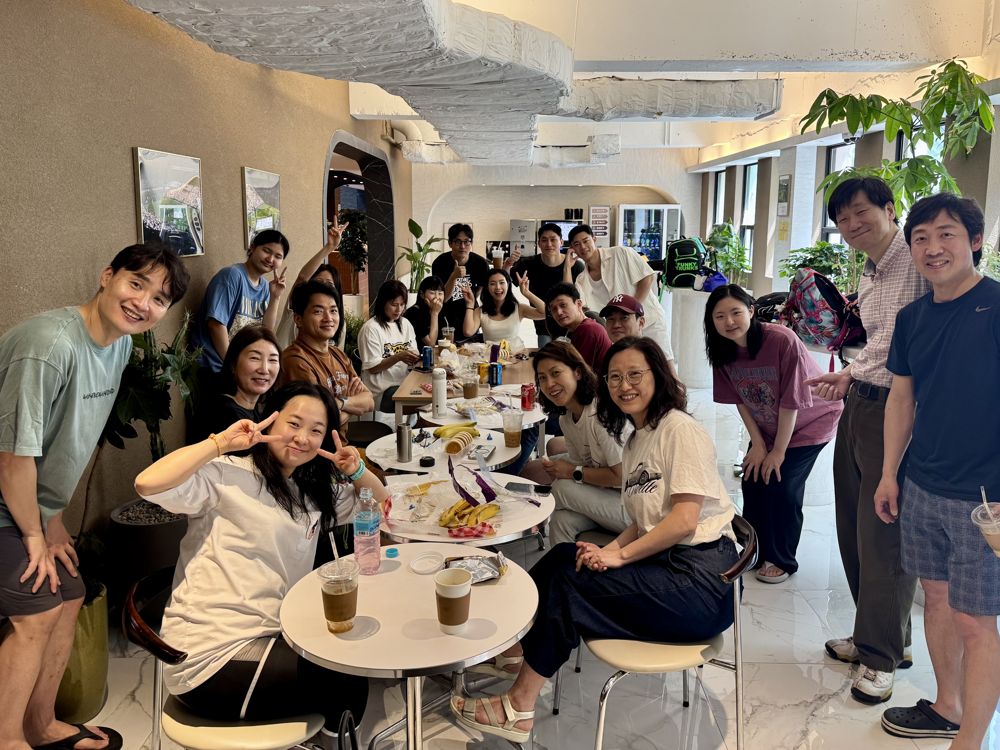

- 언더스윔과 함께하는 수영 훈련 프로그램 
- **작전명: 오징어 게임 – “무궁화 꽃이 안 피었습니다”**
- 참가신청: [BAND LINK](https://band.us/band/93484357/schedule/4%2F93484357%2F734011840%2F19700101)
- 앨범: [BAND LINK](https://band.us/band/93484357/album/87060990)

---

## 1. Warm-up

| 내용          | 거리 | 반복 | 합계  | 비고           |
|---------------|------|------|-------|----------------|
| 자유형        | 100m | 1회  | 100m  | 기본 몸풀기    |

---

## 2. 메인 수영 세트

| 내용               | 거리 | 반복 | 인터벌      | 합계  | 비고         |
|--------------------|------|------|-------------|-------|--------------|
| 자유형             | 200m | 3회  | 4분 20초    | 600m  |              |
| 자유형             | 200m | 3회  | 4분 10초    | 600m  |              |
| 자유형             | 200m | 1회  | 3분 50초    | 200m  |              |

---

## 3. 지상훈련 (드라이랜드)

- **총 6회 반복 (휘슬 소리에 맞춰 진행)**
    1. 바닥에 킥판 깔고 엎드려 팔다리 들고 킥
    2. 킥판 위에 무릎 꿇고 서서 수직으로 자유형 스트로크 당기기

---

## 4. 스프린트 & 킥 세트

| 내용                                | 거리 | 반복 | 합계  | 비고                  |
|-------------------------------------|------|------|-------|-----------------------|
| 자유형 (FAST)                       | 50m  | 7회  | 350m  | 빠른 속도             |
| 데크에 손 짚고 수직 자유형 킥       | -    | -    | -     | 자세/근력 훈련        |
| 자유형 킥 (킥판 사용, FAST)          | 50m  | 2회  | 100m  | 빠른 킥               |

---

## 5. 스타트 연습

- 남는 시간 활용, 스타트 및 돌핀킥, 브레이크아웃 연습

---

## Tip

- **멈추지 말 것!!!**  
  (모든 세트와 드릴을 중간에 쉬지 않고 연결해서 진행)

---

## **총 훈련 거리(수영 파트 합계):**  
- 워밍업: 100m  
- 메인 세트: 1,400m  
- 스프린트 & 킥: 450m  
- **총합:** **1,950m**  (지상훈련/스타트 연습 제외)
