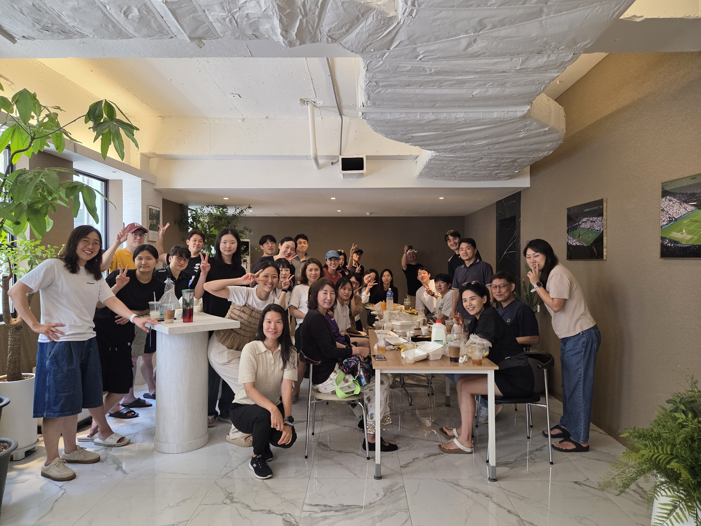

**서른일곱번째 정모**

- 참가신청: [BAND LINK](https://band.us/band/93484357/schedule/4%2F93484357%2F734010285%2F19700101)
- 사진: [BAND LINK](https://band.us/band/93484357/album/87180341)

---

**일시:** 2025-06-14 (토) 09:30~11:30  
**장소:** KBS 스포츠월드 수영장  
**총 훈련 거리:** 3,500m

---

### 1. Warm up (400m, **20분**)

| 구분           | 거리  | 반복 | 설명                       |
|----------------|-------|-------|----------------------------|
| Choice         | 200m  | 1회  | 자유 선택                  |
| Sculling I     | 100m  | 1회  | 손끝, 팔 전체로 물잡기 감각 |
| └ Front Sculling | 100m | 1회  | 전방 스컬링                |
| └ Back Sculling  | 100m | 1회  | 후방 스컬링                |

---

### 2. Main Set

#### A팀 (2레인, **80분**)

**Interval Training**

| 세트 | 거리   | 반복 | 사이클   | 인타임  | 세트 간 휴식 |
|------|--------|------|----------|---------|--------------|
| 1    | 100m   | 10회 | 1:50     | 1:30    | 2분          |
| 2    | 100m   | 10회 | 1:45     | 1:25    | 2분          |
| 3    | 100m   | 5회  | 1:40     | 1:20    | 2분          |
| 4    | 100m   | 5회  | 1:35     | 1:15    | -            |
| Easy | 100m   | 1회  | -        | -       | -            |

**A팀 명단:**  
김OO, 김OO, 김OO, 김OO, 김OO, 김OO, 김OO, 김OO,  
김OO, 김OO, 김OO, 김OO, 김OO, 김OO, 김OO, 김OO

- 2레인 전체 사용, 40분간 B조 노핀으로 참여

---

#### B팀 (1레인)

**Pre Set** (**80분**)

| 구분                                      | 거리 | 반복 | 설명                        |
|--------------------------------------------|------|------|-----------------------------|
| Freestyle Drill (w. kickboard)             | 100  | 3회  | 킥보드 사용 자유형 드릴      |
| Freestyle Kick                             | 100  | 2회  | 킥보드 킥                   |
| Freestyle Kick (w. fins)                   | 100  | 3회  | 핀 착용 킥                  |
| Freestyle Drill (w. fins/pullbuoy/kickboard)| 100 | 2회  | 다양한 도구 활용 드릴       |

**Main Set** (**120분**)

| 세트      | 거리  | 설명             | 세트 간 휴식 |
|-----------|-------|------------------|--------------|
| Freestyle | 300m  | 6분 사이클       | 2분          |
| Freestyle | 700m  | 13분 사이클      | 2분          |
| Freestyle | 1,000m| 18분 사이클      | -            |
| Easy      | 100m  | 마무리           | -            |

**B팀 명단:**  
김OO, 김OO, 김OO, 김OO, 김OO, 김OO, 김OO, 김OO,  
김OO, 김OO, 김OO, 김OO, 김OO, 김OO, 김OO, 김OO

---

### 3. 참고 및 안내

- #2레인: 앞줄출발, 바디형 유지, 45미터 지점 대연변화, 50미터 터치 연습
- #1레인: 킥과 드릴 집중, 호흡과 패턴, 페이스 유지
- 각 세트 간 2분 휴식, 인타임(목표 도착 시간) 체크
- **총 훈련 거리:** 각 팀 3,500m
